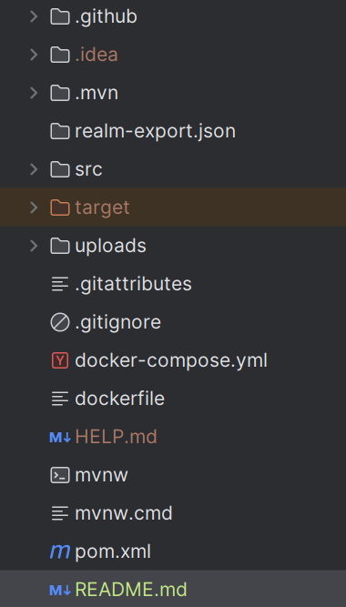
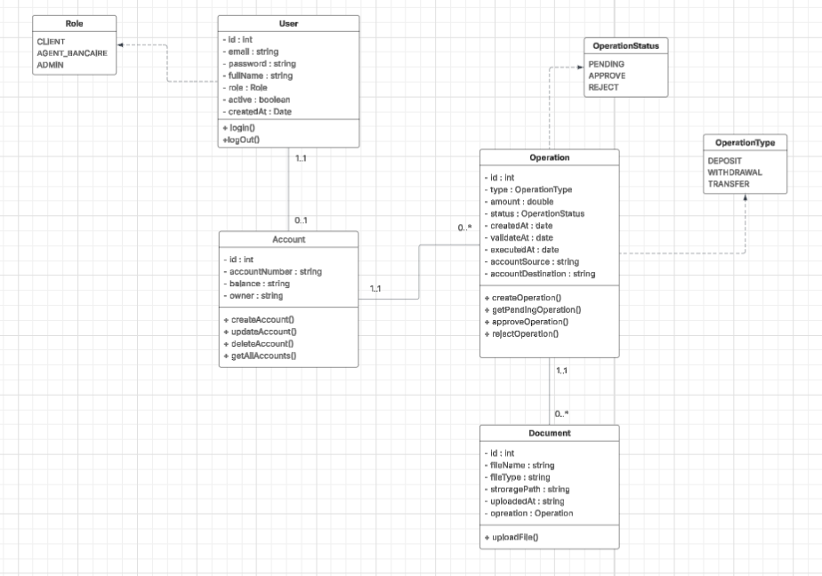

# AlBarakaDigital - Plateforme Bancaire Intelligente et Sécurisée

### Description du projet
AlBarakaDigital est une plateforme bancaire digitale développée pour la banque Al Baraka Digital, permettant la gestion sécurisée des opérations bancaires (dépôts, retraits, virements).
La plateforme combine sécurité avancée (JWT + OAuth2), interface web intuitive pour offrir une expérience bancaire moderne et sécurisée.

### Fonctionnalités principales

1. Gestion des Comptes

 - Création de comptes clients avec numéro unique 
 - Authentification sécurisée avec JWT stateless
 - Gestion des rôles (CLIENT, AGENT_BANCAIRE, ADMIN)
 - Activation/désactivation de comptes par admin

2. Opérations Bancaires

 - Dépôt : Ajout de fonds au compte
 - Retrait : Retrait de fonds avec vérification du solde
 - Virement : Transfert entre comptes
 - Validation automatique pour montants ≤ 10 000 DH
 - Upload de justificatifs pour montants > 10 000 DH

3. Workflow de Validation Intelligent

 - Validation automatique : Opérations ≤ 10 000 DH approuvées instantanément
 - APPROVE : Validation automatique
 - REJECT : Rejet automatique

4. Gestion des Documents

 - Upload de justificatifs (PDF max 5MB)
 - Stockage sécurisé des documents
 - Traçabilité complète des uploads

5. Sécurité Multi-Niveaux

 - JWT : Authentification stateless pour tous les utilisateurs
 - OAuth2 : Sécurisation des endpoints sensibles (consultation opérations PENDING)
 - BCrypt : Chiffrement des mots de passe

6. Interface Web (Thymeleaf)

 - Dashboard clients sécurisé
 - Interface agents pour validation des opérations
 - Panel admin pour gestion des utilisateurs
 - Formulaires de login avec remember-me


### Technologies utilisées

- Java 17+
- Spring Boot 3.x
- Spring Security 6 (JWT + OAuth2)
- Spring Data JPA
- PostgreSQL
- Thymeleaf (Interface web)
- Lombok
- MapStruct
- Docker & Docker Compose
- GitHub Actions (CI/CD)
- JUnit & Mockito
- Maven


### Installation et Configuration

Étape 1 : Cloner le repository

```
   git clone git@github.com:AsmaeElHamzaoui/AlBarakaDigital.git
   cd albarakadigital
```

Étape 2 : Configurer la base de données

  Créer la base de données
```
CREATE DATABASE albaraka_digital_db;

```

### Déploiement Docker

Build de l'image

```
 docker build -t albarakadigital:latest .
``` 
Lancer avec Docker Compose

```
bash docker-compose up -d
```

Le fichier `docker-compose.yml` inclut :

- Application Spring Boot
- PostgreSQL
- Configuration réseau isolée

---

### CI/CD avec GitHub Actions

Le pipeline automatisé inclut :

1. **Build** : Compilation Maven
2. **Tests** : Exécution des tests unitaires et d'intégration
3. **Quality** : Analyse de code
4. **Docker** : Build de l'image Docker
5. **Deploy** : Déploiement automatique

**Déclenchement :**
- Push sur `main`
- Pull Request

---

### Rôles et Permissions

| Rôle | Accès | Description |
|------|-------|-------------|
| **CLIENT** | `/api/client/**` | Créer opérations, consulter solde, uploader justificatifs |
| **AGENT_BANCAIRE** | `/api/agent/**` | Consulter/valider opérations PENDING (OAuth2 pour consultation) |
| **AI_AGENT** | Interne | Analyser justificatifs, recommander approbation/rejet |
| **ADMIN** | `/api/admin/**` | Gérer utilisateurs, rôles, statuts de comptes |

---

### API Endpoints

#### Authentification

| Endpoint | Méthode | Rôle | Description |
|----------|---------|------|-------------|
| `/auth/register` | POST | Public | Création de compte client |
| `/auth/login` | POST | Public | Authentification + JWT |

#### Opérations (Client)

| Endpoint | Méthode | Rôle | Description |
|----------|---------|------|-------------|
| `/api/client/operations` | POST | CLIENT | Créer opération (dépôt/retrait/virement) |
| `/api/client/operations` | GET | CLIENT | Lister ses opérations |
| `/api/client/operations/{id}/document` | POST | CLIENT | Upload justificatif |

#### Gestion Agent

| Endpoint | Méthode | Rôle | Sécurité | Description |
|----------|---------|------|----------|-------------|
| `/api/agent/operations/pending` | GET | AGENT | OAuth2 | Lister opérations PENDING |
| `/api/agent/operations/{id}/approve` | PUT | AGENT | JWT | Approuver opération |
| `/api/agent/operations/{id}/reject` | PUT | AGENT | JWT | Rejeter opération |

#### Administration

| Endpoint | Méthode | Rôle | Description |
|----------|---------|------|-------------|
| `/api/admin/users` | POST | ADMIN | Créer utilisateur |
| `/api/admin/users/{id}` | PUT | ADMIN | Modifier utilisateur |
| `/api/admin/users/{id}` | DELETE | ADMIN | Désactiver utilisateur |

---

### structure du projet


### diagramme de classe
